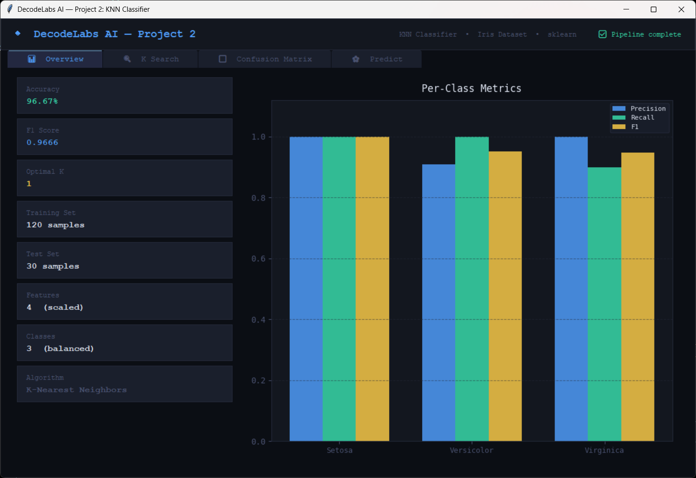
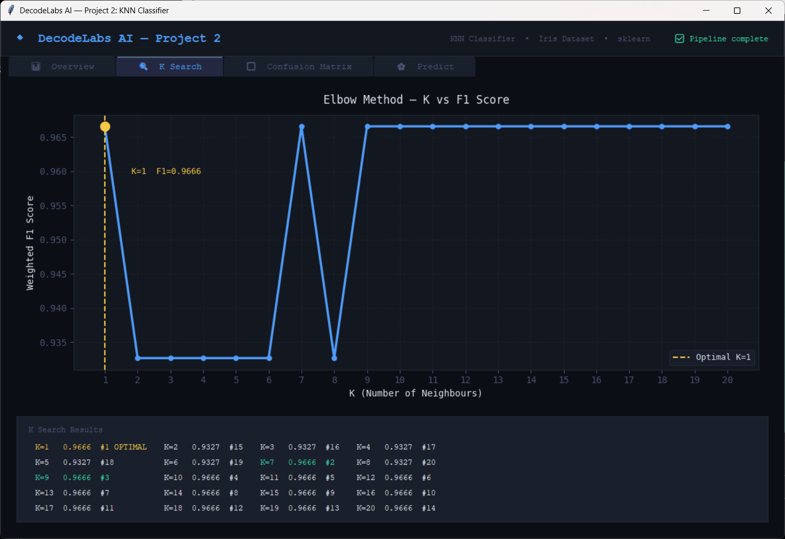
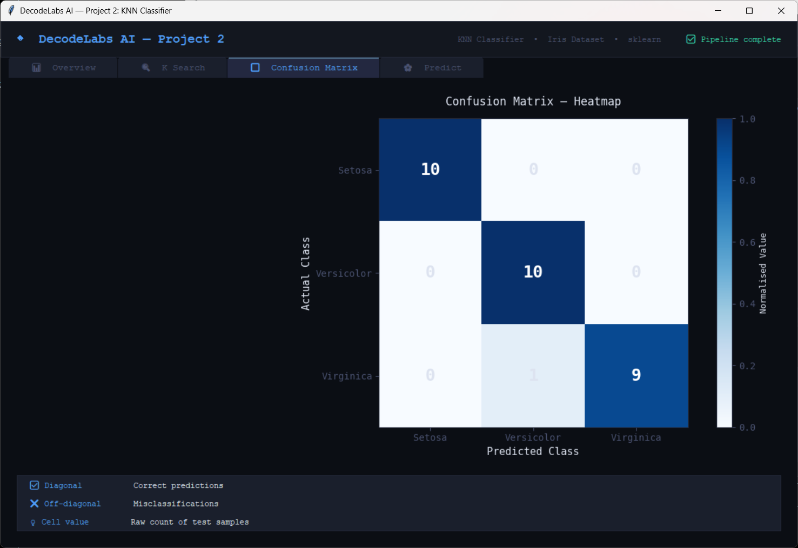
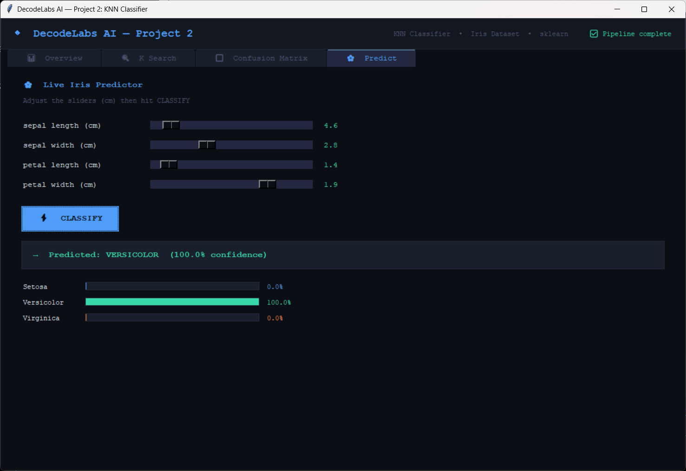

# 🤖 DecodeLabs AI — Project 2: Data Classification with KNN

<div align="center">


**K-Nearest Neighbors classifier trained on the Iris benchmark — Part of the DecodeLabs Industrial AI Training Program.**

</div>

---

## 📌 Project Overview

This is **Project 2** of the DecodeLabs AI internship series, stepping up from rule-based logic (Project 1) into **supervised Machine Learning**.

The project implements a full ML pipeline:

```
Load Data → Explore → Split → Scale → Find Optimal K → Train → Evaluate → Predict
```

The algorithm is **K-Nearest Neighbors (KNN)** — a classic, interpretable classifier that predicts a label by finding the K most similar training examples and taking a majority vote.

> *"Machine Learning is AI that learns patterns from data instead of following hard-coded rules."*

---

## ✨ Features

| Feature | Description |
|---|---|
| 📊 Full ML Pipeline | Load → Scale → K-search → Train → Evaluate in one call |
| 🔍 Elbow Method | Automatically finds optimal K (k=1 to 20 tested) |
| 🎨 Dashboard GUI | 4-tab dark-themed Tkinter desktop app |
| 📈 Live Charts | Elbow curve, per-class bar chart (Matplotlib) |
| 🔲 Confusion Matrix | Colour-coded heatmap with TP/FP annotations |
| 🌸 Live Predictor | Slider-based real-time Iris species prediction |
| 📦 Modular Design | `classifier.py` is a clean importable module |
| 🛡️ No Data Leakage | Scaler fitted on training data only |

---

## 🗂️ Project Structure

```
project-2-knn-classifier/
│
├── classifier.py       # Core ML module — pipeline, training, evaluation API
├── gui_p2.py           # 4-tab dashboard GUI — imports classifier.py
├── README.md           # This file
└── images              # contains screenshots
      ├── overview.png  # Training Overview
      ├── cm.png        # Confusion Matrix
      ├── elbow_knn.png # Choosing the best n based on Elbow method
      └── predict.png   # Page to predict based on new inputs
```

---

## ⚙️ How It Works

### The Three-Phase Pipeline

```
PHASE 1 — INPUT
  Load Iris dataset (150 samples, 4 features, 3 classes)
      ↓
  Stratified 80/20 train-test split (random_state=42)
      ↓
  StandardScaler → Mean=0, Variance=1
  (fitted on TRAIN only — prevents data leakage)

PHASE 2 — PROCESS
  Elbow Method: test K = 1 to 20
      ↓
  Select K with highest weighted F1 score
      ↓
  KNeighborsClassifier.fit(X_train, y_train)

PHASE 3 — OUTPUT
  Accuracy + F1 Score (weighted)
  Confusion Matrix (TP, FP, FN, TN)
  Full Classification Report (Precision, Recall, F1 per class)
```

### Why KNN?

KNN is a **lazy learner** — it stores all training samples and computes distances at prediction time. It's:
- ✅ Intuitive and fully interpretable
- ✅ No training phase (fast to "train")
- ⚠️ Slow on large datasets (O(n) per prediction)
- ⚠️ Sensitive to feature scale → why we **must** StandardScale

### Why Standard Scale?

KNN uses **Euclidean distance**. Without scaling, a feature measured in centimetres (range ~4–8) could dominate one in millimetres (range ~1–25), making the distance metric meaningless.

---

## 📦 Dependencies

```bash
pip install scikit-learn numpy matplotlib
```

| Package | Purpose |
|---|---|
| `scikit-learn` | KNN model, dataset, scaler, metrics |
| `numpy` | Array operations |
| `matplotlib` | Charts in the GUI |
| `tkinter` | GUI framework (bundled with Python) |

---

## 🚀 Getting Started

### ▶️ Run CLI Mode

```bash
python classifier.py
```

**Sample output:**

```
=======================================================
  DecodeLabs — Project 2: Data Classification
=======================================================

DATASET LOADED: Iris Benchmark
   Samples   : 150
   Features  : 4 → ['sepal length (cm)', ...]
   Classes   : 3 → ['setosa', 'versicolor', 'virginica']

   Class Distribution (Balanced ✓):
     setosa         : 50 samples
     versicolor     : 50 samples
     virginica      : 50 samples

TRAIN-TEST SPLIT
   Training samples : 120 (80%)
   Testing samples  : 30  (20%)

FEATURE SCALING APPLIED
   Method: StandardScaler (Mean=0, Variance=1)

FINDING OPTIMAL K (Elbow Method)...
   K     F1 Score     Status
   ------------------------------
   1     0.9666       ◄ OPTIMAL
   ...

TRAINING KNN MODEL (k=1)...

=======================================================
  OUTPUT VALIDATION REPORT
=======================================================
Accuracy  : 96.67%
F1 Score  : 0.9666 (weighted average)
```

### 🎨 Run GUI Mode

```bash
python gui_p2.py
```

The GUI opens with 4 tabs — the pipeline runs in a background thread, then all charts and the predictor populate automatically.

---

## 📸 Screenshots

### GUI — Overview Tab
> *Stats cards + per-class Precision/Recall/F1 bar chart*



### GUI — K Search Tab
> *Elbow curve showing F1 score for K=1..20, with optimal K highlighted*



### GUI — Confusion Matrix Tab
> *Blue heatmap showing prediction accuracy per class*



### GUI — Predict Tab
> *Live sliders to classify any Iris flower in real time*



---

## 🔌 Using `classifier.py` as a Module

```python
from classifier import run_full_pipeline, predict_single

# Run the entire pipeline and get all artefacts back
results = run_full_pipeline()

print(results["accuracy"])    # 0.9667
print(results["optimal_k"])  # 1
print(results["cm"])          # 3×3 numpy array

# Live prediction
cls, proba = predict_single(
    results["model"],
    results["scaler"],
    [5.1, 3.5, 1.4, 0.2],    # [sepal_len, sepal_w, petal_len, petal_w]
    results["class_names"]
)
print(cls, proba)  # setosa  [0.99 0.01 0.00]
```

### Module API Reference

| Function | Returns | Description |
|---|---|---|
| `load_and_explore()` | `X, y, class_names, feature_names` | Load Iris and print summary |
| `split_and_scale(X, y)` | `X_train, X_test, y_train, y_test, scaler` | Split + StandardScale |
| `find_optimal_k(...)` | `(best_k, results_list)` | Elbow method, K=1..20 |
| `train_model(X_train, y_train, k)` | `KNeighborsClassifier` | Fit model |
| `evaluate_model(model, X_test, ...)` | `dict` of all metrics | Full evaluation report |
| `predict_single(model, scaler, features, ...)` | `(class_name, probabilities)` | One-sample prediction |
| `run_full_pipeline()` | `dict` with all artefacts | Convenience: runs everything |

---

## 📊 Results

| Metric | Score |
|---|---|
| Accuracy | **96.67%** |
| Weighted F1 | **0.9667** |
| Optimal K | **1** |
| Setosa F1 | 1.00 |
| Versicolor F1 | 0.95 |
| Virginica F1 | 0.95 |

The single misclassification is a **Virginica** sample predicted as **Versicolor** — these two species overlap in feature space, a well-known characteristic of the Iris benchmark.

---

## 📚 Concepts Demonstrated

- **Supervised Learning** — labelled training data used to learn a mapping
- **K-Nearest Neighbors** — distance-based non-parametric classifier
- **Train/Test Split** — model evaluation on unseen data (stratified)
- **Feature Scaling** — StandardScaler prevents distance distortion
- **Data Leakage Prevention** — scaler fitted only on training set
- **Elbow Method** — systematic hyperparameter (K) optimisation
- **Confusion Matrix** — breakdown of TP, FP, FN, TN per class
- **Precision, Recall, F1** — richer evaluation than accuracy alone
- **Modular ML Design** — pipeline as importable module

---

## 🛣️ What's Next

| Project | Topic |
|---|---|
| ✅ Project 1 | Rule-Based AI Chatbot |
| ✅ Project 2 | Machine Learning — KNN Classification ← *You are here* |
| ⬜ Project 3 | Deep Learning — Neural Networks |
| ⬜ Project 4 | NLP — Language Understanding |

---

## 🏷️ Tech Stack

- **Language:** Python 3.10+
- **ML Library:** scikit-learn
- **Numerics:** NumPy
- **Charts:** Matplotlib (TkAgg backend)
- **GUI:** Tkinter + ttk
- **Dataset:** Iris benchmark (UCI / sklearn built-in)
- **Algorithm:** K-Nearest Neighbors (KNN)

---

## 📄 License

This project is part of the **DecodeLabs Industrial AI Training Program**.

---

<div align="center">
Built with 💻 as part of <strong>DecodeLabs AI Internship — Project 2</strong>
</div>